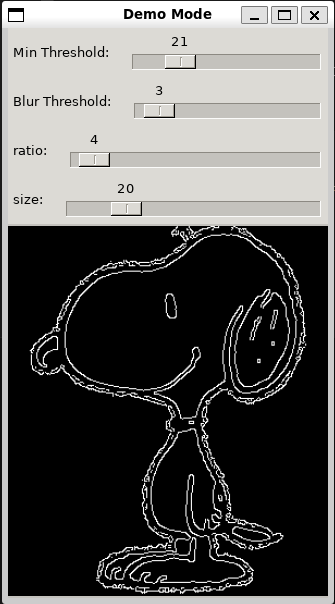
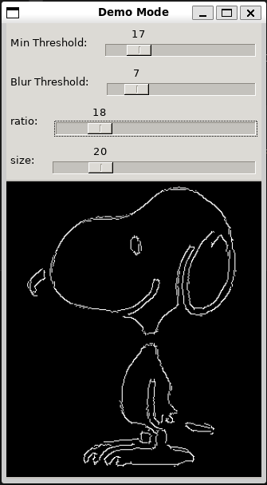

# ASCII Art Generator
This project converts images into ASCII art.

## Purpose
Most existing image-to-ASCII-art projects I have seen use the relative brightness of images to create their results. These have their charms, but are very dissimilar to handmade ASCII art, which typically outlines images, creating a result similar to a simple sketch. 

I was inspired by Junferno's YouTube video ["How I animate stuff on Desmos Graphing Calculator"](https://www.youtube.com/watch?v=BQvBq3K50u8) to use OpenCV’s library to produce an outline, which then can be used as a starting point for creating ASCII art which more closely mimics a handmade style. 

The current approach is relatively simple, but produces reasonable results - provided that the OpenCV library is able to produce a clear outline. The resulting images would likely benefit significantly from being touched up by hand. 

## Running the Project
With the open CV library installed, run the following command to build it: 

`g++ main.cpp GenerateAscii.cpp  -I <path-to-open-cv-install>/include/opencv4 -L <path-to-open-cv-install>/lib  -l opencv_core -l opencv_imgcodecs -l opencv_highgui -l opencv_imgproc`

Then, simply run the a.out file followed by a path to the image you would like to convert. 

Usage:

 `a.out filename [-d] [-b blurThreshold] [-l lowThreshold] [-r ratio] [-k kernelSize] [-h ASCIIHeight]`

Note that the order of the arguments does not matter. 

### Argument definitions: 

`-h, --help: Prints this message. Ignores all other args`

`-d, --demo: Runs the program in demo mode`

`-b, --blur: Sets the blur threshold value`

`-l, --low: Sets the low threshold value`

`-r, --ratio: Sets the ratio value`

`-k, --kernel: Sets the kernel size value. Must be 3, 5, or 7`

`-c, --height: Sets the character height of the generated ASCII art in characters`

## Notes
### Getting better images
The current algorithm essentially works by tracing the boundaries between colors and trying to find ASCII characters which best fit the outline created. This means it works best on images with few colors and sharp changes between colors (e.g. simple cartoon images). Note that having an outline around an image means the outline will be traced twice (inner color to line, line to outer color). Preprocessing images to remove outlines may improve results. 

### Example
The following is an example from start to finish of how this project can be used to produce ASCII art. Consider the following image:

Credit: wikipedia

This is an ideal candidate because of its clear, simple lines. When run through open cv, the following is produced: 

Notice how messy the resulting outline is. This is reflected in the produced ASCII art as well:

                      '-###---\#_.        
               .______/#-`      '-#L      
            _/#/------`            \#.    
          .#/`        ..        _#/_#L    
         .#/          L|     .#/_`/'//    
       ./#|                 .\/./ - L#|   
      |//-|.             #. ||| .  //#    
      '\\-\#L_.       ._/`  ||L  _//#`    
           '---\#######`  _#-\####/-      
                     -\#_/#    '          
                      #_-\#               
                    .//  '#|              
                   .#`  ..'#L             
                   |/   || |/|            
                   \\   /| /.#            
                    \#L_/###L##\##_.      
               __/#####L// #L#/----       
              /##//#/\| -` '-\##.         
              ----\##########---          

Tweaking with the results we can produce the following:

This generates the following ASCII art as well: 
                                          
                         ._ #/._.         
                      ._-       '-_       
             .__------`            \.     
           ./`       ._.        _\/_L     
          ./         '.`     _#/ ' |/     
        _.#                 .\/    .#     
       //`\.            .#  /||    //     
       '`  -\._       ._#-  |\L  _//`     
               ------##`  _-`'-\--`       
                       \_/                
                       _-\                
                     ./  '.               
                    .`  ..'_              
                    |   || /              
                    \   L| \.             
                     --\/#L-  #___        
                 _____/#\# L.    '        
               ##/##/----`  -\#           
                ' ' ---------             
                                          

Once the ideal paramaters have been found with the demo mode, they can be passed as arguments to make transforming batches of similar images quicker or provide a starting point for the next time. 

Notably, more photo realistic images are hard for opencv's line trace to parse, and thus poorer results are generated. 

### Inclusion in other projects:
The bulk of the functionality of the program comes from the GenerateAscii.cpp and .h files. The main.cpp file only handles command line interaction. Therefore, including this functionality in another project should be as simple as including the two GenerateAscii files and calling the desired functions. 

### License
This project uses the GPL 3 license. I added the license to make it clear that I am more than happy for people to use or modify the project. While I have a hard time imagining many (if any) people actually using this for anything, let me know if the license prevents you from doing something you would like to do with it, and I'll look into trying to help.

### On the programming style
Although this project is written in C++ (in large part because that is one of the languages the opencv library is available in), it is sometimes programmed more like a C program. This is simply because I wanted more practice with C programming style, though I do take advantage of some features of C++. My apologies in advance to anyone who tries to read or edit the code.
